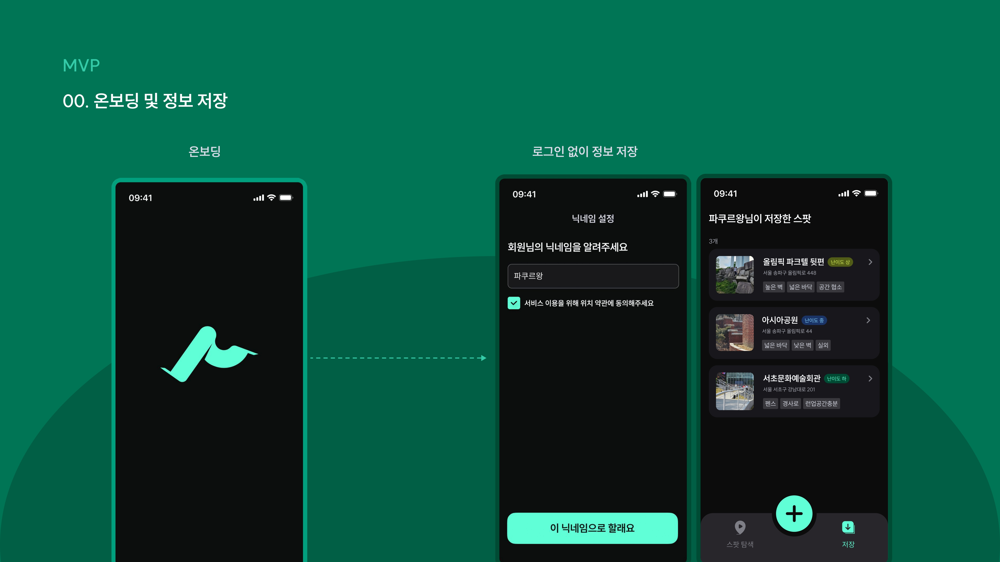
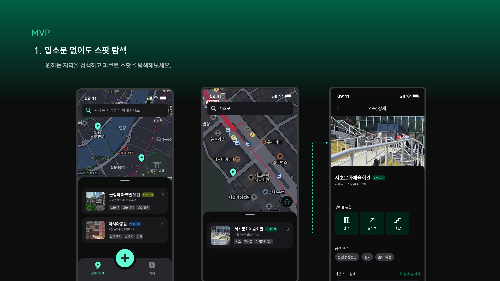
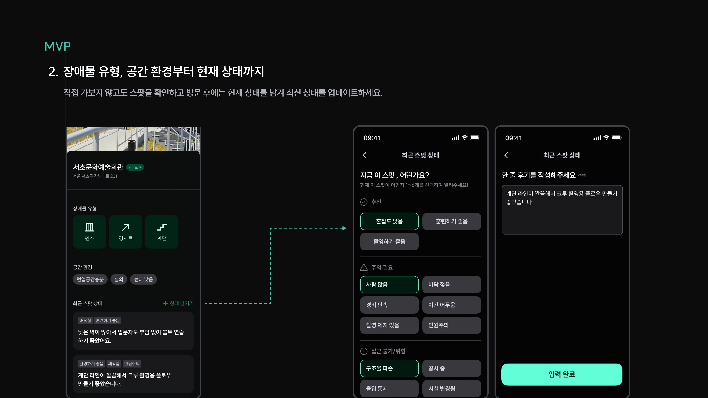
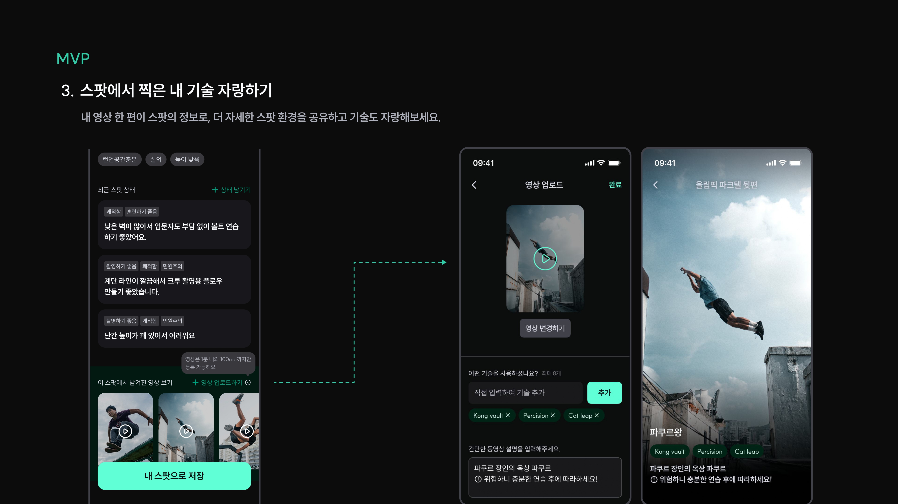
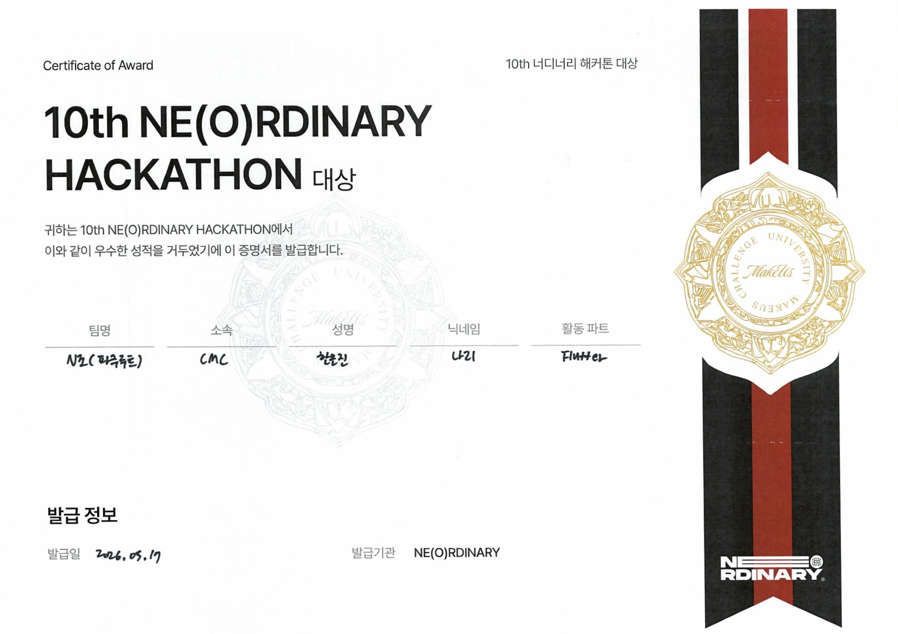

<h1>파쿠루트</h1>

도심 속 파쿠르 스팟을 탐색하고 기록하는 위치 기반 커뮤니티 플랫폼

🏆 10th Neordinary Hackathon 대상 수상

<h2>프로젝트 소개</h2>

파쿠루트는 10th Neordinary Hackathon에서 비주류 + 스포츠를 주제로 진행한 프로젝트입니다. 
국내 파쿠르는 훈련 공간과 정보 인프라가 부족해 유저들이 직접 발품을 팔아 스팟을 찾아야 하는 상황입니다. 
또한 장소의 난이도, 장애물 유형, 바닥 환경, 현재 상태를 미리 알기 어려워 입문자에게는 안전한 시작이 쉽지 않다는 문제가 있었습니다. 
파쿠루트는 이러한 문제를 해결하기 위해 파쿠르 스팟을 탐색하고 기록하며 함께 공유할 수 있도록 만든 위치 기반 커뮤니티 플랫폼입니다.

<h2>🔗 관련 링크</h2>

<ul>
  <li>
    <a href="https://www.figma.com/design/Tx9q3jZXEP5nzebO5TEVfW/N조-해커톤?node-id=170-4273&t=pRbswB4Vh993Vw1d-1">
      Figma
    </a>
  </li>
</ul>

<h2>👤 사용자 기능</h2>

<h3>📍 스팟 탐색</h3>
<ul>
  <li>지역 기반 파쿠르 스팟 검색</li>
  <li>지도 기반 스팟 탐색 UI 제공</li>
  <li>스팟 상세 정보 확인</li>
</ul>

<h3>🧗 스팟 정보 기록</h3>
<ul>
  <li>난이도 설정</li>
  <li>장애물 유형 및 공간 환경 등록</li>
  <li>대표 이미지 및 주소 정보 저장</li>
</ul>

<h3>📝 실시간 상태 공유</h3>
<ul>
  <li>현재 스팟 상태 기록</li>
  <li>한 줄 후기 작성</li>
  <li>혼잡도 및 훈련 환경 공유</li>
</ul>

<h3>🎥 영상 업로드</h3>
<ul>
  <li>스팟에서 촬영한 영상 업로드</li>
  <li>기술 태그 등록 기능</li>
  <li>영상 기반 스팟 정보 공유</li>
</ul>

<h3>⭐ 나만의 스팟 저장</h3>
<ul>
  <li>관심 스팟 저장 기능</li>
  <li>저장한 스팟 목록 관리</li>
</ul>

<h2>🖼️ UI 미리보기</h2>

<h3>온보딩</h3>

  

<h3>스팟 탐색</h3>

  

<h3>스팟 상세 & 상태 공유</h3>

  

<h3>영상 업로드</h3>

  

<h2>🏆 Award</h2>

